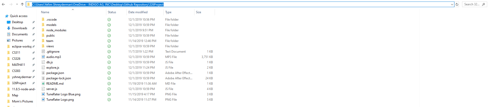
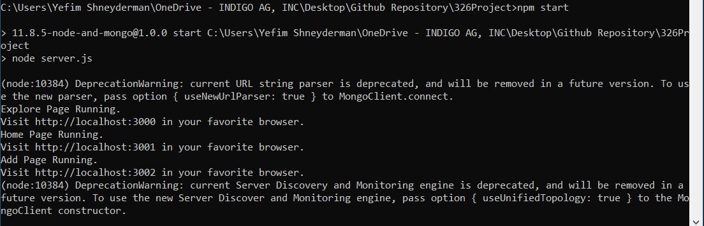

# 326 Project
The Buffaloos
Team 24 Project

TuneRater

A website where aspiring musicians can upload their music and other users can provide ratings, critiques, and suggestions for how they can improve. It will feature an improved feedback system to have way more types of points than YouTube and Spotify.

This is much needed in a world where many artists upload their work to YouTube or Spotify and can't recieve any helpful feedback short of internet harrassment, likes, or simply getting ignored. This will provide a platform for serious artists to get useful critiques of their music so that they may improve their skills and learn from others and create a community of such work.

Our project will use Data Storage (to store music) on MongoDB, a Node.js server to interact with, and possibly user accounts if we get to it.

[Yefim Shneyderman](/team/Yefim.md)

[Bruce Waters](/team/Bruce.md)

[Marco Hernandez-Muniz](/team/Marco.md)

[Ryan West](/team/Ryan.md)

# Setup Instructions

Navigate to the folder where the GitHub repository is stored locally. Copy the path.

Open command prompt and change directory to the copied path:
    *cd C:\Users\Yefim\Desktop\Github Repository\326Project*

You will need to have Node.js and npm installed. Download it [here](https://nodejs.org/en/download/).
Next in the command prompt you will need to npm install all of the required modules: express, mustache, fs, multer, etc.

Then type the following:
    *npm start*

This will setup the server on port 3000 and print "Running" if all is well.

Then open the browser and navigate to: http://localhost:3000/

To end the program type Ctrl+c into the command prompt twice.
